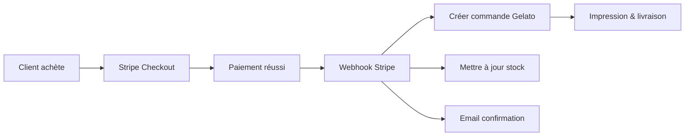

# État des intégrations Stripe & Gelato

## 📊 Status actuel - Mise à jour 08/11/2025

### ✅ Stripe - FONCTIONNEL (Mode TEST)

**Configuration:**
- ✅ Clés API configurées dans `.env.local`
- ⚠️ Mode TEST actif (clés live commentées)
- ✅ Route API `/api/stripe/checkout/route.ts` créée
- ✅ Route webhook `/api/stripe/webhook/route.ts` IMPLÉMENTÉE
- ✅ SDK Stripe installé et configuré

**Fonctionnalités implémentées:**
- ✅ Création de session checkout
- ✅ Support multilingue (FR, EN, IT)
- ✅ Collecte adresse de livraison
- ✅ Calcul prix en centimes
- ✅ URLs de succès/annulation
- ✅ Webhook pour confirmation de paiement
- ✅ Gestion automatique du stock après vente
- ✅ Déclenchement automatique impression Gelato

**À implémenter:**
- ⏳ Envoi email de confirmation client
- ⏳ Sauvegarde commandes en base de données
- ⏳ Dashboard admin pour suivi commandes

### ✅ Gelato - CLIENT API IMPLÉMENTÉ

**État actuel:**
- ✅ Client API Gelato créé (`/lib/gelato-client.ts`)
- ✅ Intégration avec webhook Stripe
- ✅ Mapping automatique formats → produits Gelato
- ✅ Support Fine Art Giclee 12 couleurs
- ⚠️ En attente clés API réelles

**Fonctionnalités implémentées:**
- ✅ Création de commandes d'impression
- ✅ Vérification statut commandes
- ✅ Annulation commandes
- ✅ Calcul des prix
- ✅ Gestion livraison France + Europe

**Configuration requise:**
1. ✅ Créer compte sur https://www.gelato.com
2. ⏳ Obtenir clés API production
3. ⏳ Ajouter dans `.env.local`:
   ```
   GELATO_API_KEY=votre_cle_api
   GELATO_WEBHOOK_SECRET=votre_webhook_secret
   ```

## 🔧 Actions requises

### 1. Activer Stripe en production

```bash
# Dans .env.local, décommenter les clés LIVE :
STRIPE_SECRET_KEY=sk_live_51SOcU4EBNbSya4pr...
NEXT_PUBLIC_STRIPE_PUBLISHABLE_KEY=pk_live_51SOcU4EBNbSya4pr...
```

### 2. Créer le webhook Stripe

Créer `/app/api/stripe/webhook/route.ts`:
```typescript
import { headers } from 'next/headers';
import Stripe from 'stripe';

export async function POST(req: Request) {
  // Vérifier signature webhook
  // Traiter événement payment_intent.succeeded
  // Déclencher commande Gelato
  // Mettre à jour stock
}
```

### 3. Intégrer Gelato

Créer `/lib/gelato-client.ts`:
```typescript
class GelatoClient {
  async createOrder(orderData: any) {
    // Appel API Gelato
    // Créer commande d'impression
  }
}
```

### 4. Flux complet



## 🚨 Problèmes critiques

1. **Mode TEST actif** - Les paiements réels ne fonctionneront pas
2. **Pas de webhook** - Les paiements ne sont pas traités après confirmation
3. **Pas d'imprimeur** - Aucune commande d'impression automatique
4. **Pas de gestion stock** - Les éditions limitées ne se décrémentent pas

## ✅ Pour tester Stripe maintenant

1. Le site utilise actuellement les clés TEST
2. Utiliser carte de test : `4242 4242 4242 4242`
3. Date expiration : future
4. CVC : n'importe quoi
5. Le paiement passera en mode test

## 📝 Prochaines étapes prioritaires

1. **Créer compte Gelato** (https://www.gelato.com)
2. **Obtenir clés API Gelato**
3. **Créer webhook Stripe** dans dashboard Stripe
4. **Implémenter `/api/stripe/webhook`**
5. **Créer client Gelato**
6. **Tester flux complet en TEST**
7. **Passer en LIVE quand prêt**

## 🔑 Variables d'environnement nécessaires

```bash
# Stripe (actuellement configuré)
STRIPE_SECRET_KEY=sk_test_...
NEXT_PUBLIC_STRIPE_PUBLISHABLE_KEY=pk_test_...
STRIPE_WEBHOOK_SECRET=whsec_... # À ajouter

# Gelato (à ajouter)
GELATO_API_KEY=... # À obtenir
GELATO_WEBHOOK_SECRET=... # À obtenir
```

## 📞 Support

- **Stripe Dashboard**: https://dashboard.stripe.com
- **Gelato Dashboard**: https://www.gelato.com/dashboard
- **Documentation Stripe**: https://stripe.com/docs
- **Documentation Gelato**: https://developers.gelato.com

---

**IMPORTANT**: Ne pas activer les clés LIVE avant d'avoir testé le flux complet en mode TEST !

// Lalou